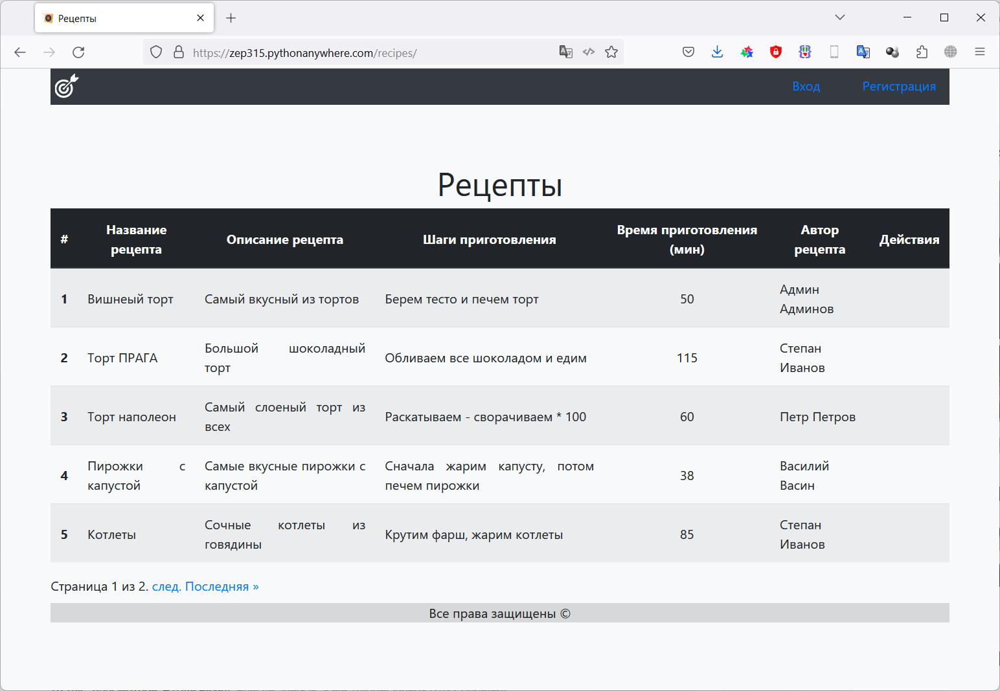
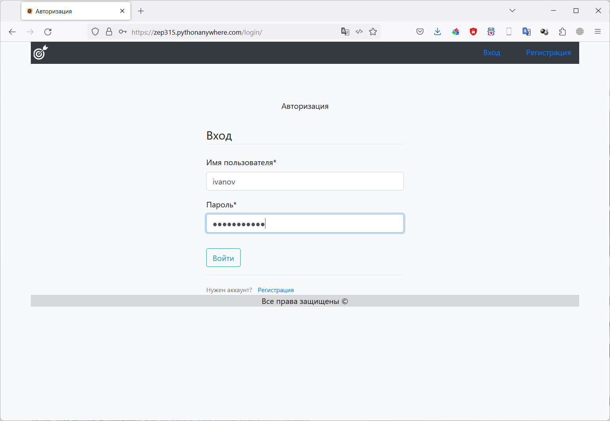
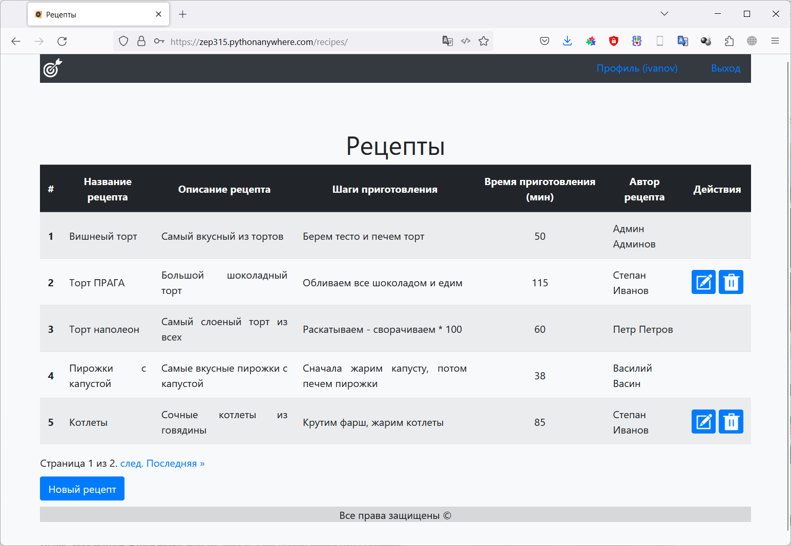
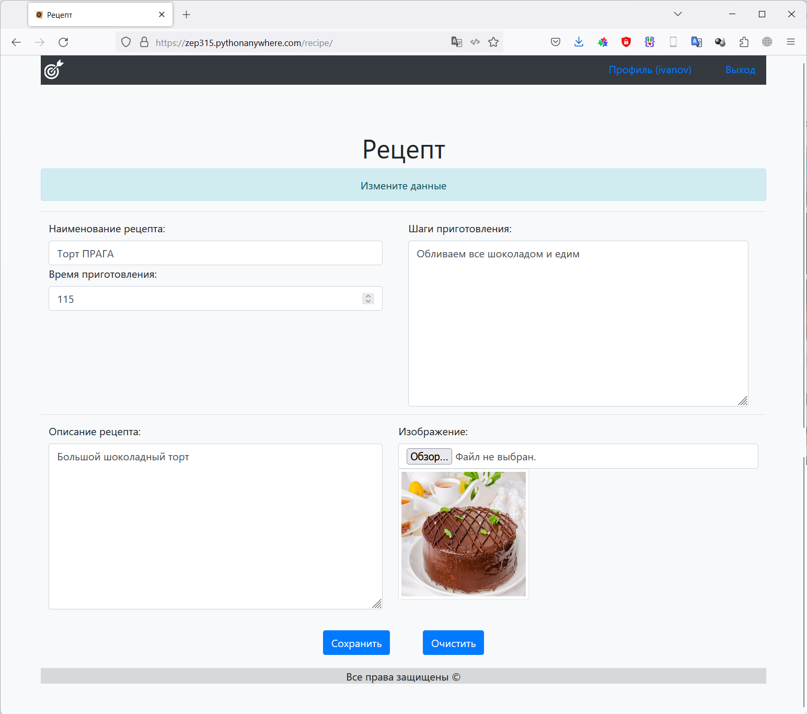
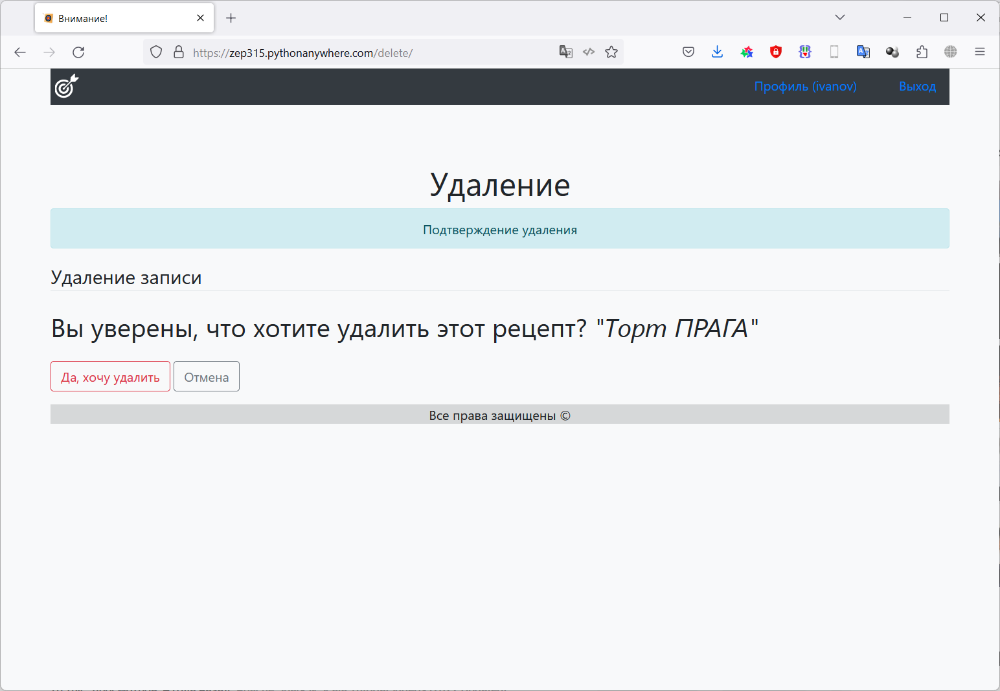
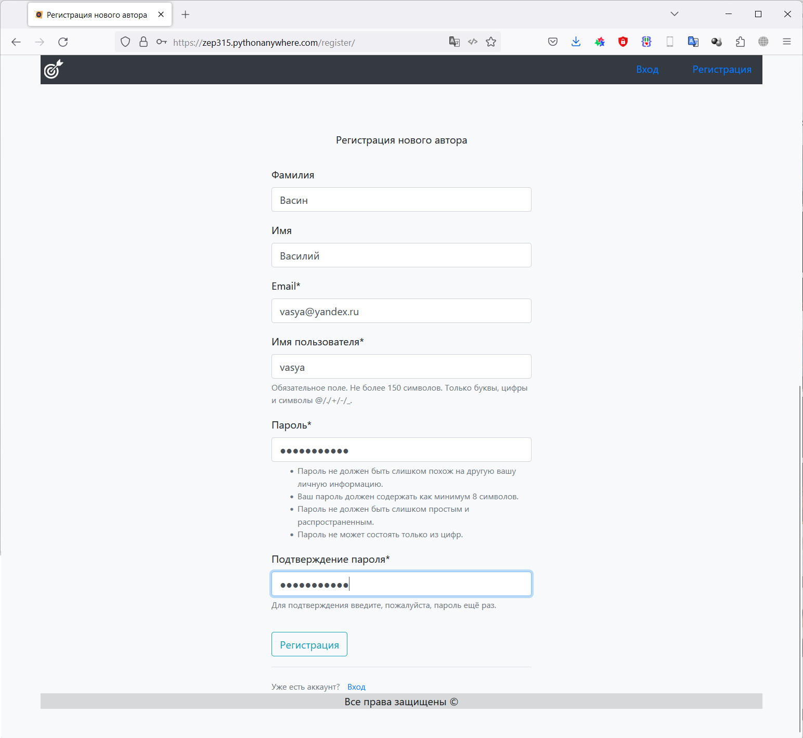

# Фреймворк Django (семинары)
## Итоговая аттестация

### Задание 1
Используя фреймворк Django создайте сайт, на котором пользователи смогут
добавлять свои рецепты блюд и просматривать рецепты других пользователей.
Готовый проект необходимо сдать в виде ссылки на рабочий сайт в сети интернет и
репозитория с исходным кодом проекта.

### Решение

Устанавливаем Django:

    pip install django

Создаем проект для работы:

    django-admin startproject cook_recipe

Переходим в папку проекта:

    cd .\cook_recipe\

Создаем новое приложение в проекте:

    python manage.py startapp website

Запускаем сервер проекта:

    python manage.py runserver

Редактируем файлы:
*********
- [Django_Itog/cook_recipe/website/settings.py](/cook_recipe/cook_recipe/settings.py)
- [Django_Itog/cook_recipe/website/urls.py](/cook_recipe/cook_recipe/urls.py)
- [Django_Itog/cook_recipe/website/urls.py](/cook_recipe/website/urls.py)
- [Django_Itog/cook_recipe/website/views.py](/cook_recipe/website/views.py)

Создаем модель данных, в соответствие с заданием. 
Модель данных находится в файле: 

- [Django_Itog/cook_recipe/website/models.py](/cook_recipe/website/models.py)

Для временного заполнения таблиц были реализованы некоторые из **CRUD** методов.

Примеры методов находятся в пакете *commands*:

- [Django_Itog/cook_recipe/website/management/commands/](/cook_recipe/website/management/commands)

Создаем миграции для нашей модели данных (подготавливаем структуру базы данных для развертывания на сервере БД):

    python manage.py makemigrations cook_recipe

Применяем миграции (Физически создаем объекты на сервере БД):

    python manage.py migrate

В файле представлений описан запрос в базу данных и вызов формы представления данных по запросу

- [Django_Itog/cook_recipe/website/views.py](/cook_recipe/website/views.py)

Так же были подготовлены шаблоны для отображения формы. Файлы с шаблонами:

- [Django_Itog/cook_recipe/website/templates/website/base.html](/cook_recipe/website/templates/website/base.html)
- [Django_Itog/cook_recipe/website/templates/website/menu.html](/cook_recipe/website/templates/website/menu.html)
- [Django_Itog/cook_recipe/website/templates/website/recipe_delete.html](/cook_recipe/website/templates/website/recipe_delete.html)
- [Django_Itog/cook_recipe/website/templates/website/recipe_detail.html](/cook_recipe/website/templates/website/recipe_detail.html)
- [Django_Itog/cook_recipe/website/templates/website/recipes.html](/cook_recipe/website/templates/website/recipes.html)

Для более эстетичного восприятия был добавлен [bootstrap](https://getbootstrap.com/)

Так же - создаем папку для хранения изображений, и указываем ее в настройках 

- [Django_Itog/cook_recipe/cook_recipe/settings.py](/cook_recipe/cook_recipe/settings.py)

        MEDIA_URL = '/media/'
        MEDIA_ROOT = BASE_DIR / 'website/media'

В файле *urls.py* указываем маршруты к новой форме редактирования рецепта, и к папке, 
в которой хранятся изображения  

- [Django_Itog/cook_recipe/cook_recipe/urls.py](/cook_recipe/cook_recipe/urls.py)

Разрабатываем представление для формы создания/редактирования рецепта: 

- [Django_Itog/cook_recipe/website/forms.py](/cook_recipe/website/forms.py)

Разрабатываем шаблон для отображения формы создания/редактирования рецепта:

- [Django_Itog/cook_recipe/website/templates/website/recipe_detail.html](/cook_recipe/website/templates/website/recipe_detail.html)

В файле *views.py* описываем логику работы представления

- [Django_Itog/cook_recipe/website/views.py](/cook_recipe/website/views.py)

Прописываем маршрут и класс для отображения формы в файле *urls.py*

- [Django_Itog/cook_recipe/website/urls.py](/cook_recipe/website/urls.py)

Создаем пользователя - администратора нашего проекта

    python manage.py createsuperuser

    (venv) PS C:\Work\python\Django\Django_Itog\cook_recipe> python manage.py createsuperuser
    Имя пользователя: Admin
    Адрес электронной почты: admin@mail.ru
    Password:
    Password (again):
    Введённый пароль слишком широко распространён.
    Введённый пароль состоит только из цифр.
    Bypass password validation and create user anyway? [y/N]: y
    Superuser created successfully.
    (venv) PS C:\Work\python\Django\Django_Itog\cook_recipe>

Делаем соответствующие настройки для панели администрирования в файле 

- [Django_Itog/cook_recipe/website/admin.py](/cook_recipe/website/admin.py)

Заходим в панель управления, вводим заданный ранее пароль.

Далее можно управлять данными, которые находятся у нас в безе.

#### Разворачивание приложения на сервере в интернете

Регистрируемся на площадке [https://www.pythonanywhere.com/](https://www.pythonanywhere.com/).

Создаем базу данных MySQL, устанавливаем кодировку в консоли mysql
    
    ALTER DATABASE Zep314$default CHARACTER SET utf8 COLLATE utf8_general_ci;

После внесения настроек (удаление настроек, связанных с отладкой), загружаем готовую версию проекта на GitHub/

В консоли *pythonanywhere.com* клонируем проект

    git clone https://github.com/Zep314/Django_Itog.git

Создаем виртуальное окружение

    mkvirtualenv --python=/usr/bin/python3.10 virtualenv

Устанавливаем необходимые пакеты:

    cd Django_Itog
    pip install -r requirements.txt

Делаем необходимые настройки в панели управления сайтом, делаем миграцию базы данных.

## Результат работы:

Проект сделан с возможностью авторизации пользователей. Причем неавторизованный пользователь может увидеть только
рецепты, а если пользователь авторизуется, то тогда он сможет добавлять, редактировать и удалять свои рецепты.
Администратор сайта может редактировать и уудалять любые рецепты.
Так же на странице рецептов выполнена пагинация на 5 элементов.

Сайт расположен по адресу: [https://zep315.pythonanywhere.com/](https://zep315.pythonanywhere.com/)

Страница списка рецептов (без авторизации)

Страница авторизации пользователей

Страница списка рецептов (пользователь авторизовался)

Страница добавления / изменения рецепта

Запрос на подтверждение удаления рецепта

Сраница регистрации нового пользователя

Для проверки можно посмотреть сайт со следующими регистрационными параметрами:

ivanov: zaq1Xsw2!@#

